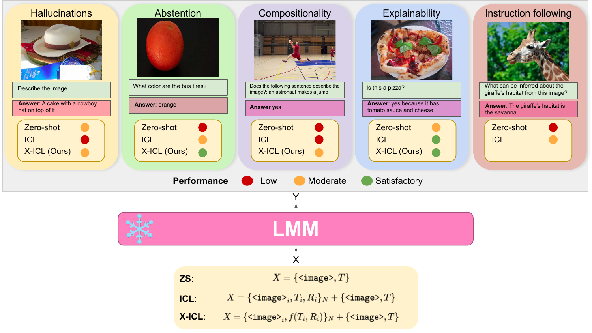
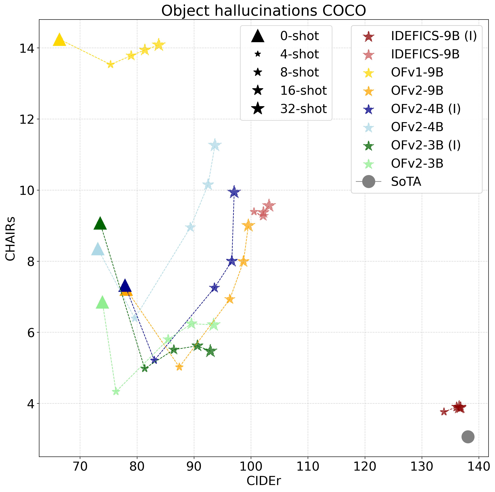
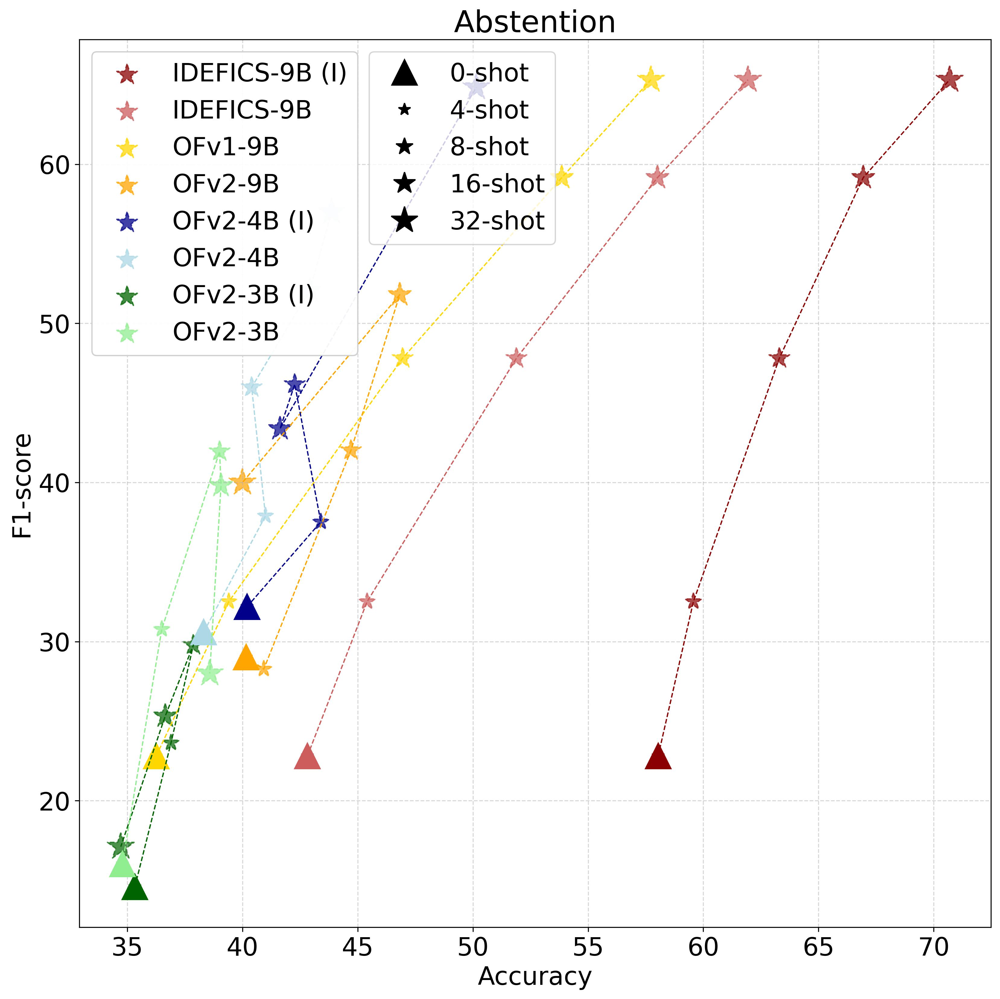
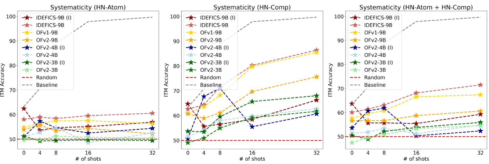
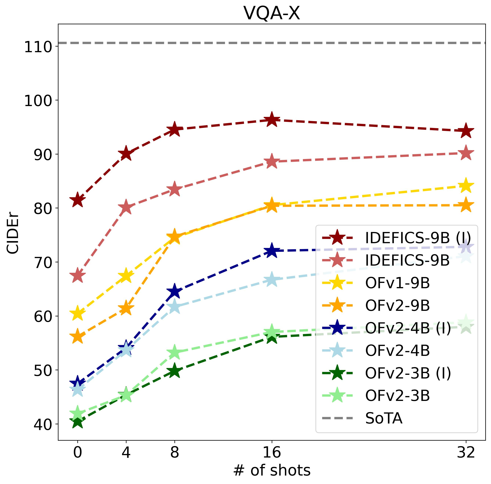
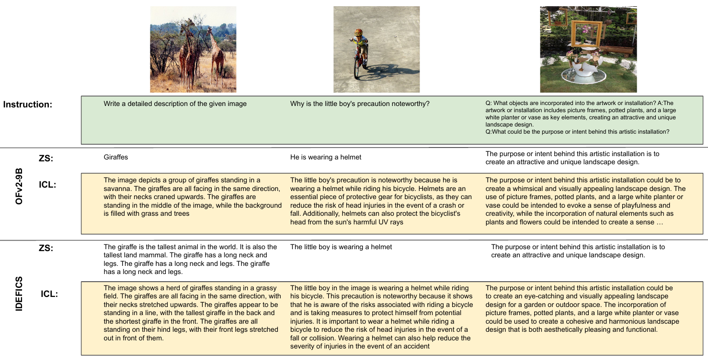
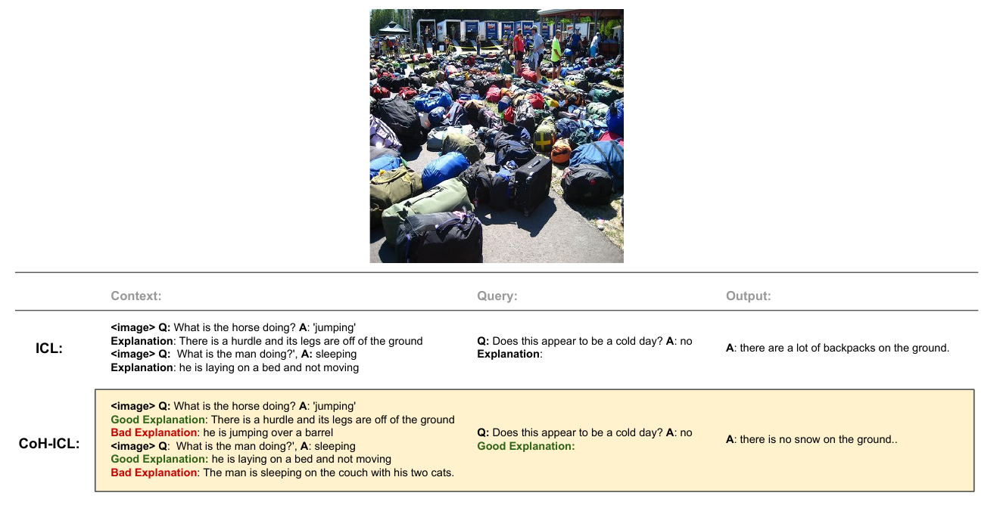
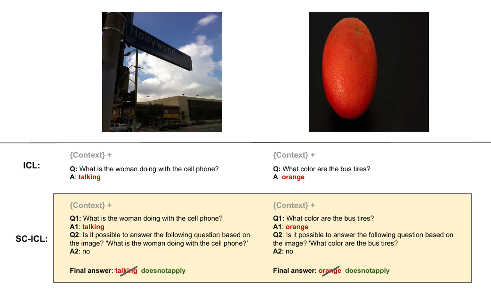
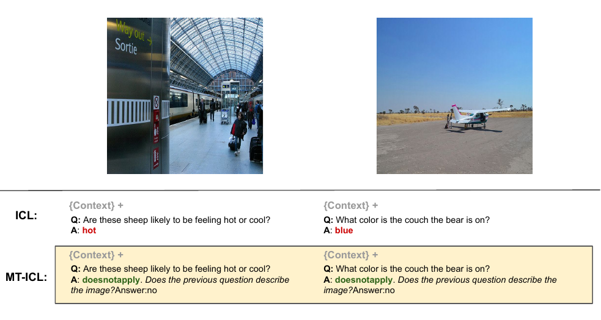

<!-- # installation

Chairplus: 

python3 -m spacy download en_core_web_lg
python -m spacy download en
 pip install SceneGraphParser -->


<p align="center">
    <br>
    
    <br>
<p>


<p align="center">
        &nbsp<a href="https://evalign-icl.github.io/">Project Page</a> &nbsp | &nbsp<a href="https://arxiv.org/abs/">Paper (soon) </a>&nbsp 
</p>

# (EvALign-ICL) Beyond Task Performance: Evaluating and Reducing the Flaws of Large Multimodal Models with In-Context Learning

 EvALign-ICL is an evaluation framework, based on academic and public datasets, for large multimodal models (LMMs). Currently, the evaluation of LMMs spans 5 different axes; object hallucinations, answer abstention, compositionality, explainabilty and instruction following. We propose 3 setups; zero-shot, in-context learning (ICL) and different variants of ICL (X-ICL). 

<p align="center">
    <br>
    
    <br>
<p>


> **Abstract**: Following the success of Large Language Models (LLMs), Large Multimodal Models (LMMs), such as the Flamingo model and its subsequent competitors, have started to emerge as natural 
steps towards generalist agents. However, interacting with recent LMMs reveals major limitations that 
are hardly captured by the current evaluation benchmarks. Indeed, task performances (\emph{e.g.}, VQA accuracy) 
alone do not provide enough clues to understand their real capabilities, limitations, and to which extent 
such models are aligned to human expectations. To refine our understanding of those flaws, we deviate from 
the current evaluation paradigm and propose the <strong>EvALign-ICL</strong> framework 
(Beyond Task Performance: <strong>Eval</strong>uat<strong>i</strong>n<strong>g</strong> and Reduci<strong>n</strong>g the Flaws of Large 
Multimodal Models with <strong>I</strong>n-<strong>C</strong>ontext <strong>L</strong>earning), in which (1) we <strong>evaluate 8 recent open-source LMMs</strong> (based on the 
Flamingo architecture such as OpenFlamingo and IDEFICS) on 5 different axes; <strong>hallucinations, 
abstention, compositionality, explainability and instruction following</strong>. Our evaluation on these axes 
reveals major flaws in LMMs. To efficiently address these problems, and inspired by the success of 
in-context learning (ICL) in LLMs, (2) <strong>we explore ICL as a solution and study how it affects these limitations</strong>. 
Based on our ICL study, (3) <strong>we push ICL further and propose new multimodal ICL approaches such as; 
Multitask-ICL, Chain-of-Hindsight-ICL, and Self-Correcting-ICL</strong>. <br></br> 
<strong><i>Our findings</i></strong> are as follows. 
(1) Despite their success, LMMs have flaws that remain unsolved with scaling alone. 
(2) The effect of ICL on LMMs flaws is nuanced; despite its effectiveness for improved explainability, 
abstention, and instruction following, ICL does not improve compositional abilities, and actually 
even amplifies hallucinations. (3) The proposed ICL variants are promising as post-hoc approaches to 
efficiently tackle some of those flaws.


# News
* **[2023.10.1]**: The code will be released soon. For now you can install the libraries, download the models and prepare the datasets !

# Table of Contents
- [Installation](#installation)
- [Usage](#usage)
- [Evaluation](#evaluation)
- [X-ICL](#x-icl)
- [Extending EvALign-ICL](#extending-evalign-icl)
- [Acknowledgments](#acknowledgments)
- [Citing](#citing)


# Installation
Our installation follow the installation of [OpenFlamingo](https://github.com/mlfoundations/open_flamingo). To run IDEFICS you need a recent transformers library. The main libraries that we use are as follows:

```
torch == 2.0.1
torchvision == 0.15.2
transformers == 4.28.0
accelerate == 0.21.0
```

# Usage
To do inference on custom images and see your results you can check [OpenFlamingo](https://github.com/mlfoundations/open_flamingo#usage) and [IDEFICS](https://huggingface.co/blog/idefics)


# Evaluation on the EvALign-ICL benchmark

### Technical notes

The scripts to launch the evaluation can be found here `scripts/`. 

Scripts containing `of` or `idefics` in their name are used to evaluate OF or IDEFICS models respectively. To evaluate a particular model, uncomment the corresponding lines in the script.

The `MODE` is used to slect the evaluation setup: ICL, MT-ICL (MultiTask-ICL), SC-ICL (Self-Correcting-ICL) or CoH-ICL (Chain-of-Hindsight-ICL).

If you want to test only in zero-shot you can set the number of shots to `0`. 
We use one GPU of 32GB, sometimes you need bigger GPU (40GB) to evaluate the biggest models with 32 shots. For IDEFICS it is faster to use A100 GPUs as it is evaluated with BFloat16.

For OF models, we download the models and read them from our local repo (as we don't have  access to internet on the cluster).

## Object Hallucinations

### Dataset

* Download: download [COCO](https://cocodataset.org/#download) captioning dataset (we use val2014). Also you need the [synonyms](https://github.com/LisaAnne/Hallucination/tree/master/data) for the CHAIR metrics.

* Format: the data['annotations'] (data loaded from `captions_val2014_objs_vinvl.json`) is `captions_val2014.json` augmented with objects list for each image for example:

```
{'image_id': 179765,
 'id': 182,
 'caption': 'A Honda motorcycle parked in a grass driveway',
 'objects': ['tire', 'wheel', 'land vehicle', 'tree', 'vehicle', 'motorcycle']}
  ```
You need objects only if you want to test MT-ICL. The objects are extracted with VinVL object detection model and can be downloaded from [here](https://nuage.isir.upmc.fr/index.php/s/qyqfW8ZNFP6qBmm). The ids are the coco image ids.

### Evaluation
Launch scripts `scripts/object_hallucinations/`.

Evaluation setups selected with `MODE`: ICL (`baseline`) or MT-ICL (`caption_objects`).


<p align="center">
    <br>
    
    <br>
<p>

> Object hallucination. CIDEr (↑) for captioning and CHAIRs (↓) for hallucination on COCO dataset.

## Answer Abstention

### Dataset
* Download: download the [TDIUC](https://kushalkafle.com/projects/tdiuc.html#download) dataset. 
* Format: it has similar format to VQAv2. the data['annotations'] (data from `TDIUC/Annotations/mscoco_val2014_annotations.json`)  contains items in the following format (all types including the absurd one):
```
{'question_type': 'absurd',
 'image_id': 448308,
 'ans_source': 'generation',
 'answers': [{'answer': 'doesnotapply',
   'answer_confidence': 'yes',
   'answer_id': 1}],
 'question_id': 10370276}
```

### Evaluation
Launch scripts `scripts/abstention/`.

Evaluation setups selected with `MODE`: ICL (`baseline`), MT-ICL (`vqa_abstention`) and SC-ICL.

For SC-ICL: 
* first launch with `vqa_abstentiononly` to classify the questions, 
* then with `correct_shot`/`correct_32shot` (for SC-ICL and SC-ICL 32shots) while setting `PREVIOUS_PREDS` to the path generated from the classification  `path/tdiuc_unans_results_seed.json`. For simplicity we do the classification before the correction.


<p align="center">
    <br>
    
    <br>
<p>

> Abstention. Overall VQA accuracy (↑) and abstention F1-score (↑) on TDIUC dataset.

## Compositionality

### Dataset
* Download: download the [CREPE](https://github.com/RAIVNLab/CREPE/tree/master/data) dataset and images from [Visual Genome](https://homes.cs.washington.edu/~ranjay/visualgenome/api.html)
* Format: the data from `syst_vg_hard_negs_seen_compounds_in_laion.json` contain items in the following format:
```
{'region_id': '374',
 'caption': 'a red brick paved sidewalk',
 'x': '346',
 'y': '329',
 'width': '452',
 'height': '269',
 'valid_hard_negs_comp': ['a red mall and blue sidewalk',
  'a red alley and black sidewalk',
  'a red alley and yellow sidewalk'],
 'valid_hard_negs_atom': ['a brown brick paved sidewalk',
  'a white brick paved sidewalk',],
 'image_id': '2',
 'valid_hard_negs_combined': ['a brown brick paved sidewalk',
  'a white brick paved sidewalk',
  'a purple brick paved sidewalk','],
 'image_path': 'VG_100K/2.jpg',
 'objects': [{'object': 'walk sign'},
  {'object': 'backpack'},]
 'image_w': 800,
 'image_h': 600}
``` 
Objects are used for MT-ICL. Objects are from the annotations of visual genome (`path/visual_genome/annotations/objects.json`). 

### Evaluation
Launch scripts `scripts/compositionality/`.

Evaluation setups selected with `MODE`: 

* For ITM:  ICL (`itm`) and MT-ICL (`itm_objects`)

* For ITS: ICL (`baseline`).

To evaluate on systematicity, you need to set `COMPOS` to `sys` and  `NEG_TYPE` to ; `atom` (HN-Atom), `comp` (HN-Comp), `combined` (HN-Atom + HN-Comp). For the baseline (the negative is a random caption sampled from the COCO dataset) you need to set `COMPOS` to `normal` and `NEG_TYPE ` to `baseline`.


<p align="center">
    <br>
    
    <br>
<p>

> Compositionality. Models are evaluated on the CREPE benchmark with the ITM task. We evaluate on systematicity, we consider 2 types of negative captions: HN-Atom (replacing atoms, such as objects, attributes, or relations with atomic foils) and HN-Comp (composing two negative captions constructed with HN-Atom). We noticed similar observations with productivity

## Explainability

### Dataset
* Download: download [VQA-X](https://github.com/Seth-Park/MultimodalExplanations#vqa-x). It uses images from coco.  
* Format: data['annotations'] from `vqaxtest_v2_mscoco_val2014_annotations.json` contains items of the following format:
```
{'question_type': 'what is this',
 'multiple_choice_answer': 'shower',
 'answers': [{'answer': 'shower', 'answer_confidence': 'yes', 'answer_id': 1},
  {'answer': 'shower', 'answer_confidence': 'yes', 'answer_id': 2},
  {'answer': 'shower', 'answer_confidence': 'yes', 'answer_id': 3},
  {'answer': 'shower', 'answer_confidence': 'yes', 'answer_id': 4},
  {'answer': 'shower', 'answer_confidence': 'maybe', 'answer_id': 5},
  {'answer': 'shower', 'answer_confidence': 'yes', 'answer_id': 6},
  {'answer': 'shower', 'answer_confidence': 'yes', 'answer_id': 7},
  {'answer': 'shower', 'answer_confidence': 'yes', 'answer_id': 8},
  {'answer': 'shower', 'answer_confidence': 'yes', 'answer_id': 9},
  {'answer': 'shower', 'answer_confidence': 'yes', 'answer_id': 10}],
 'image_id': 262284,
 'answer_type': 'other',
 'question_id': 262284001,
 'explanation': ['it has a shower head hanging inside of it.',
  'there is a shower head',
  'There is a faucet and a bathtub.'],
 'question': {'image_id': 262284,
  'question': 'What is this?',
  'question_id': 262284001}}

```

### Evaluation
Launch scripts `scripts/explainability/`.

Evaluation setups selected with `MODE`: 

* For Answer only:  ICL (`baseline`)

* For explain only: ICL (`explainonly`).

* For answer and explain: MT-ICL (`answer_and_explain`) 

* For CoH-ICL: first explain only generation of the query (`explainonly_evalquery`), then Coh-ICL (`explainonly_contrastive_prevqout_32shotvsgt`) with `PREV_Q_OUT` set to the generated explanation (`vqax_results_seed.json`).


<p align="center">
    <br>
    
    <br>
<p>

> Explainability. Models are asked to generate an explanation for image, question and answer triplets from the VQA-X dataset.

## Instruction Following

### Dataset
* Download: doanload [LlAVA](https://llava-vl.github.io/) from [here](https://github.com/haotian-liu/LLaVA/blob/main/docs/Data.md). It uses COCO images.
* Format: for example the `llava_complex_reasoning_77k.json` contains items with the following format:

```
{'global_image_id': 'coco.215677',
 'image_path': 'coco/train2014/COCO_train2014_000000215677.jpg',
 'anns_id': 'lllava_complex_reasoning_77k.215677',
 'question': 'What skill set might someone need to perform such a frisbee trick?',
 'answer': 'To perform the frisbee trick shown in the image, where the man is passing a frisbee between or underneath his legs, a person would need a combination of skills. These skills include good hand-eye coordination, agility, balance, flexibility, and dexterity. Additionally, the ability to throw and catch the frisbee accurately while maintaining control of bodily movements would also be essential. To perfect the trick, practicing these skills and building up muscle memory through repetition would be beneficial.',
 'image_id': 215677}
``` 
Other instruction types follow similar format.

### Evaluation
Launch scripts `scripts/instruction_following/`.

Evaluation setups selected with `MODE`, currently we only evaluate with ICL on LlaVA complex questions (`llava_complex_questions`), detailed descriptions (`llava_detail_questions`), conversations (`llava_conv_questions` or `llava_conv_dialog_questions`)

For zero-shot (not a la Flamingo) we set the num of shots to 1 (these are the results illustrated in the paper when we refer to ZS instruction following) 


<p align="center">
    <br>
    
    <br>
<p>

> Instruction following. Qualitative evaluation results of IDEFICS and OFv2-9B on the LlaVA benchmark on 3 types of instructions (from left to right): detailed descriptions, complex questions and conversations.

# X-ICL
We push ICL further and propose new improved variants to address some of LMMs limitations. We explore 3 variants illustrated below; CoH-ICL, SC-ICL and MT-ICL.

<p align="center">
    <br>
    
    <br>
<p>

> CoH-ICL to improve model explainability. The context consists of; an image, question, answer, human annotation as the good response, and previous model's generation (with ICL 32-shot) as the bad response.

<p align="center">
    <br>
    
    <br>
<p>

> SC-ICL for answer abstention, we first ask the model the question using ICL. Then, for each question, we ask the model to decide whether the question is answerable based on the image or not. In case the model recognizes that the question is not answerable, the previous answer is  ignored and replaced with an abstention keyword. The correction is with 32-shot in this step 2.
            
<p align="center">
    <br>
    
    <br>
<p>

> MT-ICL for abstention. The main task is to answer the question and the second auxiliary task is to decide whether the question is relevant to the image or not.


# Extending EvALign-ICL

Adding new Benchmarks/Models/Metrics

ToDo

# Acknowledgments
The code is mainly based on the following previous work: [OpenFlamingo](https://github.com/mlfoundations/open_flamingo) and [IDEFICS](https://huggingface.co/blog/idefics).

The authors would like to thank [Hugo Laurençon](https://huggingface.co/HugoLaurencon) for fruitful discussions.


# Citing
If you found this repository useful, you can cite it as:

```
      @article{shukor2023beyond,
        title={Beyond Task Performance: Evaluating and Reducing the Flaws of Large Multimodal Models with In-Context Learning},
        author={Shukor, Mustafa and Rame, Alexandre and Dancette, Corentin and and Cord, Matthieu},
        journal={arXiv preprint arXiv:2310.00647},
        year={2023}
      }     
```
